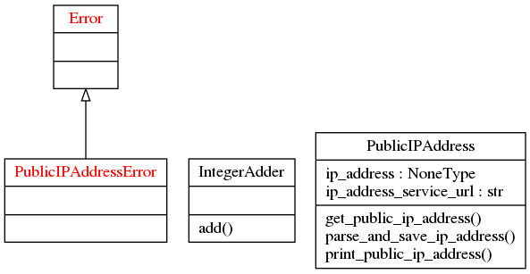

# PythonAwesomeApp
A source-code template for Python3 applications.

## Quick-Start
*Please note that, as of now, these instructions are applicable to linux based systems (Ubuntu). Support for MacOS & Windows will be coming soon.*

### Creating a Python project based on this template
* Install cookiecutter
  
  `pip3 install --user cookiecutter`

* Create a python project
  
  `python3 -m cookiecutter https://github.com/afaquejam/PythonAwesomeAppTemplate.git`

### Running this app
* Clone this source-code repository:

  `git clone git@github.com:afaquejam/PythonAwesomeApp.git`

* Set up the Python's Virtual Env.
  ```
  python3 -m venv virtualenv
  source virtualenv/bin/activate
  ```
* Install dependencies:

  `pip3 install -r requirements.txt`

* Run the app:
  
  `make`

* Run the tests:

  `make test`

* Generate, view test-reports & code-coverage reports (assuming `firefox` is pre-installed):

  `make test_report`

* Turn off the Python virtualenv.

  `deactivate`

## Source-Code Organization
* Source-code organization guidelines are [here](docs/source_code_org.md). Please note that in this project, `__init__.py` has been used because it was a requirement of the  `pyreverse` tool.
* The source-code organization of this project looks as show below. Please note that some directories have not been shown for readability purposes.
```
.
├── __init__.py
├── awesome_app
├── package_one
│   ├── __init__.py
│   ├── module_one.py
│   ├── config
│   │   └── integer_adder.cfg
│   └── tests
│       └── test_integer_adder.py
.
.
.
├── makefile
├── LICENSE
├── CHANGELOG.md
├── README.md
└── requirements.txt
```

## Testing & Mocking
* Use Pytest.
  - Use pytest fixtures for set-up & teardown functions.
  - Use parameterized tests.
  - Use pytest-cov to generate test reports.
  - Use pytest plugins to enhance your test reports.
* Mocking
  - Use unittest.mock
  
## Development Work-flow
* Assumptions:
  - The application needs few `run-time dependencies` & `dev-dependencies`.

  - During the development phase, you need both `run-time dependencies` & `dev-dependencies`.

  - When the source-code is pushed to the remote git repo, the CI/CD would run the tests & if successful, package this app. In this case, the CI/CD would need to install both type of dependencies.

  - The application needs to be installed on the target runtime environment. In this case, only `run-time dependencies` need to be installed.

* In this case, our work-flow would be as follows:

  - Dependencies (both types) should be specified in a `requirements-to-freeze.txt` file.
  
  - Install the dependencies:

    `pip3 install -r requirements-to-freeze.txt`

  - When you're about to commit your changes, freeze your dependency versions by running the following command:
  
    `pip3 freeze > requirements.txt`

  - Dependencies will be installed on the CI/CD or on the target run-time environment using the command:
  
    `pip3 install -r requirements.txt`

  - You can upgrade your dependencies by running the following commands:
  
    ```
    pip3 install -r requirements-to-freeze.txt --upgrade
    pip3 freeze > requirements.txt
    ```

* A mechanism of separating the `dev-dependencies` from `run-time dependencies` must be found, such that only run-time dependencies are installed on the target run-time environment.

* In this project, an effort is on-going to simplify the developer work-flow: https://docs.pipenv.org/


## Profiling
* Install the profiling softwares:
  
  ```
  pip3 install snakeviz memory_profiler matplotlib
  sudo apt-get install nethogs iotop
  ```
* Measure running time of a program:
  ```
  python3 -m cProfile -o app.prof awesome_app
  snakeviz app.prof
  ```
* Measure memory consumption of a program:
  ```
  mprof run ./awesome_app
  mprof plot
  ```

* Measure I/O:
  - Network: `nethogs`
  - Disk: `iotop`
  - Both provide rudimentary interface to view the I/O information.

## Linting
* PEP 8 style guide (https://bit.ly/1ARqSBt) is recommended.
* Automate linting in your favorite code-editor.
* Configuring VSCode for Python programming: https://gist.github.com/afaquejam/af1c3a2d3ab00aa8528d945d98bf5a57

## Documentation
* Changelog, git-tagging & release notes.
  - Changelog guidelines by `Keep a Changelog` are recommended: https://keepachangelog.com/en/1.0.0/
  - Use `git-tags` to tag your git repository & keep it consistent with the changelog.
  - Maintaining release notes is up-to you how you maintain them. Example release notes: https://atom.io/releases
  - You might argue that what's the difference between between changelog & release notes? In my opinion, changelog is much more verbose than release notes. However it's up-to you how you differentiate between them.

* User documentation
  - Please make sure you have instructions how to install your software, it's dependencies & run it.

* Developer documentation
  - Make sure you have relevant documentation for developers such that they can navigate, read, understand & contribute to the project.

## Packaging & Release
* There are different ways to package a Python app depending on how it's going to be used. Here's a nice introduction on the topic: https://docs.python-guide.org/shipping/packaging/
* If the app you're developing is a library, then packaging it  as a `wheel` distribution &/or uploading it to PyPI is an option. Here's a good tutorial on it: https://packaging.python.org/tutorials/packaging-projects/
* If you're distributing your app as a standalone application, then `pyinstaller` is the magical tool for you. This tool can produce a self-contained single app file, which contains the Python interpreter, the app & it's dependencies, for all Mac, Windows & Linux. Steps to create a distribution package for your app (it'll produce binaries for the OS on which it's built):
  - Install pyinstaller: `pip3 install pyinstaller`
  - `pyinstaller awesome_app -n awesome_app --onefile`
  - In this case, `awesome_app` is the main script which gets executed & `-n` option is the name of the app.
  - This will create the app binary `dist` folder. Copy & distribute. Simple as that!

## Concurrency & Parallelism
* Concurrent programs can be written using Python's `threading` module. However, please note that due to the Global Interpretor Lock (GIL) in CPython & PyPy, threads will not execute in parallel.
* If you want to achieve true parallelism on a multi-core processor system, then `multiprocessing` module provides a way to spawn multiple processes, which can run parallely.
* Python provides good thread & process synchronization mechanisms. You can check their respective sync. mechanisms.
* Queues are recommended ways for inter-thread & inter-process communication.
* Relevant resources:
  - `threading`: https://pymotw.com/3/threading/index.html
  - `multiprocessing`: https://pymotw.com/3/multiprocessing/index.html
  - Thread sync mechanisms: https://docs.python.org/3/library/threading.html#lock-objects
  - Process sync mechanisms: https://docs.python.org/3.7/library/multiprocessing.html#synchronization-between-processes
  - Queue: https://pymotw.com/3/queue/index.html

## Async.
* `async` & `await` is the way to go (v3.5 & above). However, the documentation on this topic is not good.
* A talk on this topic from its creator: https://www.youtube.com/watch?v=m28fiN9y_r8
* Other resource: https://pymotw.com/3/asyncio/

## Improving Performance: PyPy
* Pypy claims to be approx. 7 times faster than CPython. It's generally useful in case your app runs for a long time, in contrast to a Python script which just does one-off operation.
* Tread carefully, since we're in the realm of performance optimization. I agree with taking the following steps before performing any optimization:
  - Measure app performance.
  - Profile your code.
  - Optimize.
* Also, please identify if your app's core logic is `compute-bound` or `I/O bound`. With PyPy, `compute-bound` code can be optimized.

## PyReverse
* Using PyReverse, you can generate UML diagrams for your app. This can be helpful in understanding & refactoring your code.
* Install pyreverse: `sudo apt-get install pylint`
* Usage (run this command from outside the project's directory): `pyreverse -o png -p PythonAwesomeApp PythonAwesomeApp/`
* Class diagram of this app

  
